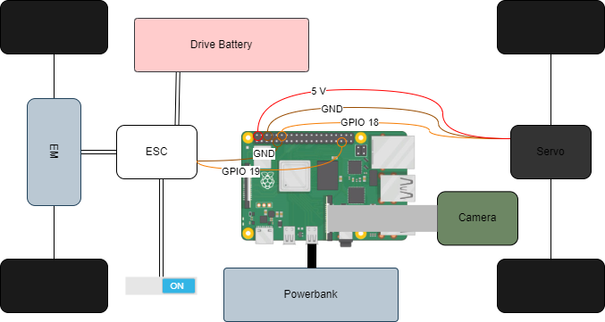

# rpi_controlled_car
This GitHub repository contains the documentation and code for a project where an RC car has been reconstructed to be controlled by a Raspberry Pi. The vehicle can be piloted via a user-friendly graphical interface (HMI) running on a mobile device. 


## Components
### Mechanics/Hardware
* RC Car: Tamiya Stadium Blitzer
* Raspberry Pi 4 1 GB 
* Raspberry Pi Camera module 2
* [Electronic Speed Control (ESC)](./data/pdf/euro_speedo_manual.pdf)
* [Powerbank](https://www.amazon.de/dp/B0C99KW2YQ?starsLeft=1&ref_=cm_sw_r_cso_em_apan_dp_1AEE1RMAXBRPCCMASA4N): 5v - min. 3 A (USB-C plug)
* Drive battery: NiCd 7.2 V - 1500 mAh (Tamiya plug)


<br>



## Software
**RaspberryPi**
* Debian: Raspbian GNU/Linux 10 (buster)
* Connection to WiFi
* Docker (25.0.4)
* Node.js (node: v10.24.0; npm: 5.8.0)

**Mobile Device**
* Mozilla Firefox

## Software Start-up
The software consists of three modules communicating with each other:
* **camera**: Streaming of the video captured by the Raspberry Pi camera module
* **hmi**: Visualizing the streamed video and pilot the car
* **control**: Control the steer and drive based on the inputs from hmi

The communication is managed by a MQTT broker.
### GitHub repository
Clone GitHub repository.
```
git clone https://github.com/maxschoenstein/rpi_controlled_car
```

### Start mosquitto docker container
You need a running MQTT broker for communication between the modules
```
docker compose up mqtt
```

### Automatic startup 
For an automatic startup copy `./start.sh` in custom directory that is not the project directory e.g. usr/bin/start.sh.
```
#!/bin/bash
# Start camera and log output
/usr/bin/python3.7 /path/to/repository/camera/src/main.py &
# Start hmi and log output
node /path/to/repository/hmi/src/server.js &
# Start control and log output
/usr/bin/python3.7  /path/to/repository/control/src/main.py
```
Make it executable
```
chmod +x /usr/bin/start.sh
```

Add a crontab job executed at reboot:
```
sudo crontab -e -u <user_name>
```
Add following line at end of the file. 
```
@reboot sleep 20; /bin/bash  usr/bin/start.sh
```

Alternativly execute  `./start.sh` manually.
```
./start.sh
```
## HMI
Connect your mobile device to the same WiFi your RaspberryPi is connected. <br>
Go to the Mozilla Firefox webbrowser on your mobile device and search for ``<raspberrypi_ip>:3000/index.html``. Other browsers may not support the device orientation handling.

You should see following webpage: <br>
 


### Orientation handling
By rotating your mobile device around the z-axis you can steer the car. 
By rotating your mobile device around the x-axis you can cotrol the speed of the car. 
### Slider
* **Sensitivity**: Controls the sensitivity of the device orientation
* **Speed**: Sets the maximal drivabl speed of the car
### Buttons
* **Start**: Calibrates the neutral device orientation and starts the control of the car
* **Stops**: Sets the drive and steer to neutral. To control the car again press **Start**.
* **Quit**: Disconnects device from car.
